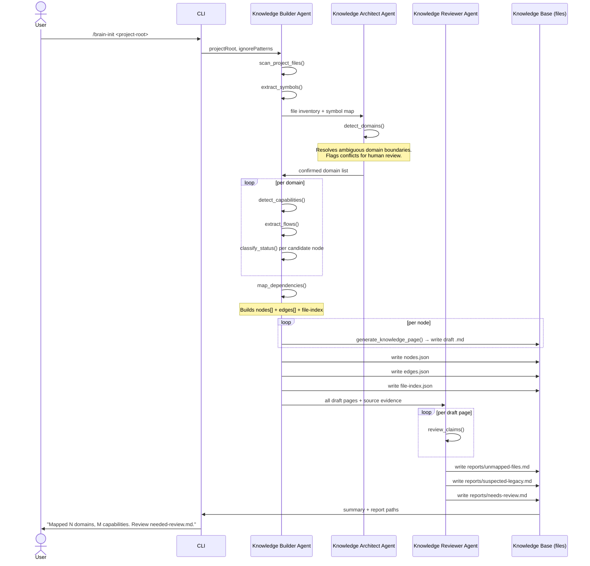
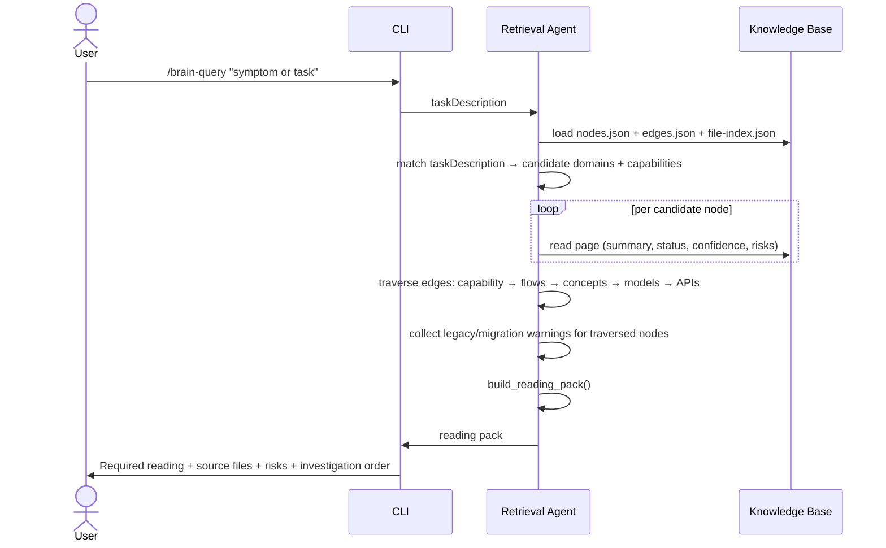
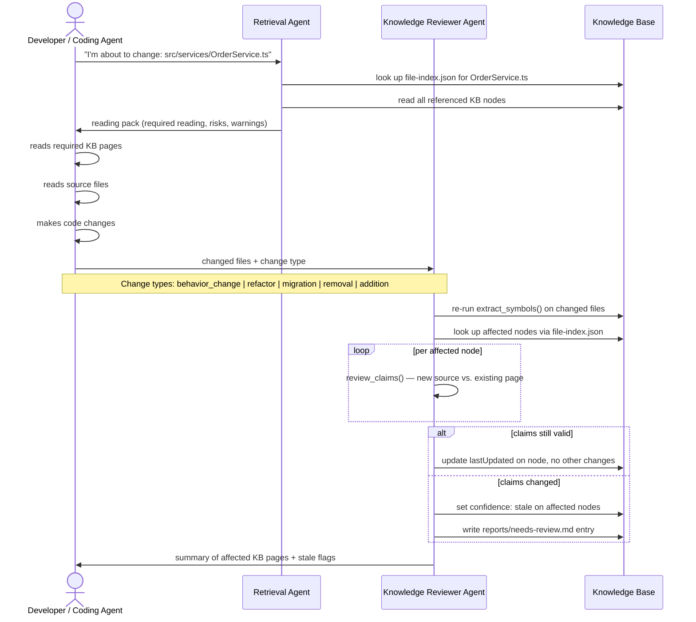
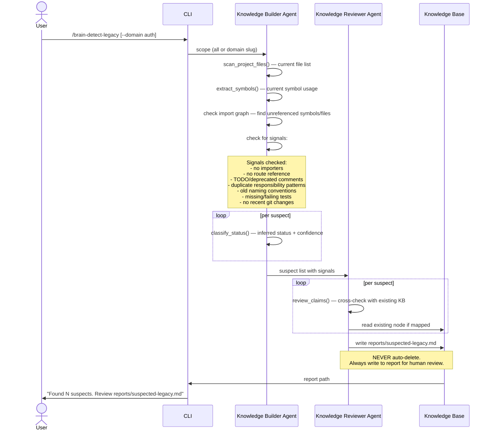
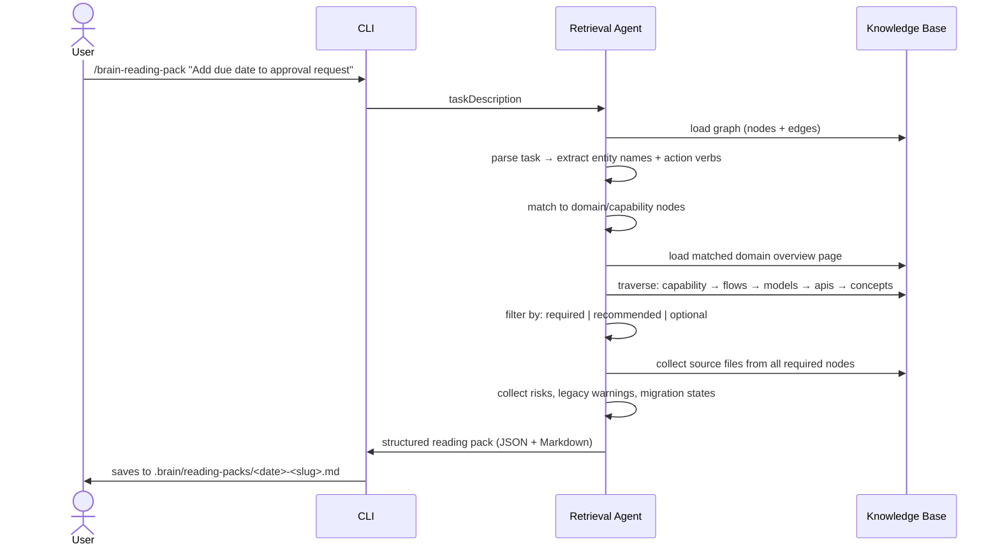
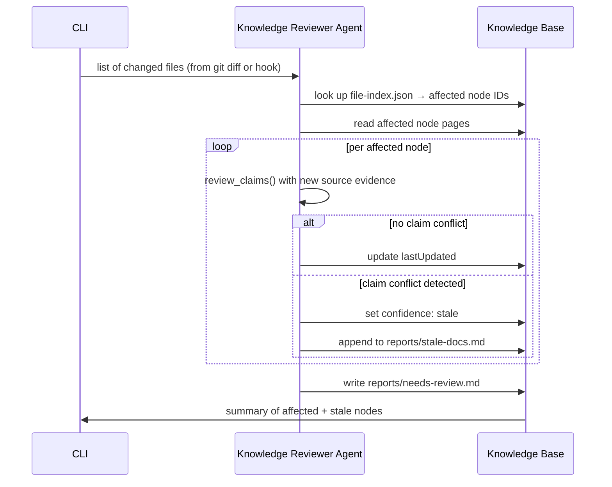

# Workflows

Core workflow sequence diagrams. All diagrams use Mermaid syntax.

---

## 1. Initial Mapping Workflow

**Trigger:** `/brain-init <project-root>`

**Purpose:** Produce the first knowledge map for a project.



**Outputs:**
- Domain overview pages
- Capability, concept, flow pages
- `nodes.json` + `edges.json` + `file-index.json`
- `reports/unmapped-files.md`
- `reports/suspected-legacy.md`
- `reports/needs-review.md`

---

## 2. Debugging / Investigation Workflow

**Trigger:** `/brain-query "symptom description"`

**Purpose:** Help a human or coding agent understand where to start for a given problem.



**Output shape:**
```
Required reading (ordered):
  1. domain/auth/overview.md         [required]   — domain context
  2. domain/auth/flows/login.md      [required]   — runtime path
  3. domain/auth/concepts/session.md [recommended] — key concept
  4. domain/auth/models/user.md      [optional]   — data shape

Likely source files:
  - src/api/auth/login.ts
  - src/services/AuthService.ts
  - src/repositories/UserRepository.ts
  - src/cache/SessionCache.ts

Risks:
  [HIGH] legacy auth path still active — see caveat: legacy-basic-auth
  [MED]  cache invalidation may not fire on partial updates

Investigation order:
  1. Confirm which route is actually called
  2. Trace service method
  3. Check cache invalidation
  4. Check legacy path
```

---

## 3. Code Change Workflow

**Trigger:** Developer or agent is about to modify source files.

**Purpose:** Ensure KB is read before changes and flagged after changes.



---

## 4. Legacy Detection Workflow

**Trigger:** `/brain-detect-legacy [--domain <slug>]`

**Purpose:** Surface code that may be unused, duplicated, or partially migrated.



**Report format for each suspect:**
```
## src/services/OldPaymentService.ts

Status: suspected_unused
Confidence: inferred
Signals:
  - No files import this module
  - Replaced by: src/services/PaymentV2Service.ts (inferred)
  - Last modified: 2024-11-03
  - No tests reference this service

Action required: Human must confirm before deletion
```

---

## 5. Reading Pack Workflow

**Trigger:** `/brain-reading-pack "task description"`

**Purpose:** Generate a focused context bundle for a specific task.

This is similar to the Debugging workflow but always produces a structured, saveable output rather than just an investigation guide.



**Reading pack file format:**
```md
---
task: Add due date to approval request
generated: 2026-05-07
domain: workflow
confidence: source_supported
---

## Required Reading

1. [Workflow Domain Overview](domains/workflow/overview.md) — required
2. [Create Approval Request](domains/workflow/capabilities/create-approval-request.md) — required
3. [Approval Request Model](domains/workflow/models/approval-request.md) — required
4. [Approval Request Flow](domains/workflow/flows/create-approval-request.md) — required

## Source Files

- src/models/ApprovalRequest.ts
- src/services/ApprovalService.ts
- src/api/routes/approval.ts
- src/repositories/ApprovalRepository.ts
- tests/approval/create.test.ts

## Warnings

- [HIGH] Approval model is partially migrated — old schema still in use for legacy forms
- [MED] due_date field may interact with auto-close scheduler (see: AutoCloseFlow)

## Recommended Investigation Order

1. Read model to understand current schema
2. Check migration state for old approval schema
3. Confirm API route accepts and validates date fields
4. Check if due_date needs to propagate to notification flow
```

---

## 6. KB Update From Diff Workflow

**Trigger:** `/brain-update --diff <git-diff-output>` or post-merge hook (future)

**Purpose:** Detect which KB pages are affected by a set of file changes and flag them for update.


